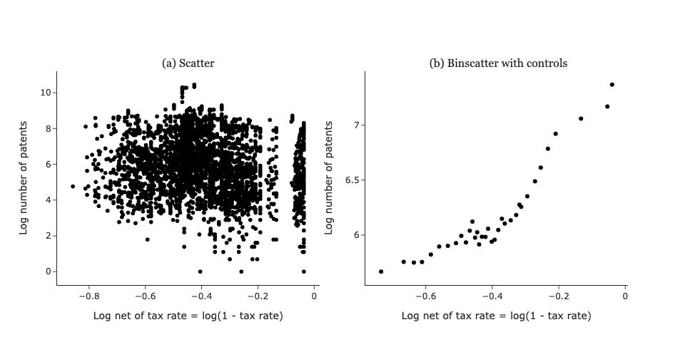

# Dataframe agnostic binscatter plots

**TL;DR:** Fast binscatter plots for all kinds of dataframes.

- Built on the `narwhals` dataframe abstraction, so pandas, Polars, DuckDB, Dask, and PySpark inputs all work out of the box.
  - All other Narwhals backends fall back to a generic quantile handler if a native path is unavailable
- Lightweight - little dependencies
- Just works: by default picks the number of bins automatically via the rule-of-thumb selector from Cattaneo et al. (2024) - no manual tuning
- Efficiently avoids materializing large intermediate datasets
- Uses `plotly` as graphics backend - because: (1) it's great (2) it uses `narwhals` as well, minimizing dependencies
- Pythonic alternative to the excellent **binsreg** package


## Installation

```bash
pip install binscatter
```

---

## Example

On the left is a standard scatter plot of patenting activity (`lnpat`) against the 3-year lagged top marginal tax rate (`mtr90_lag3`) for US states between 1981 and 2007. On the right is a covariate-adjusted binscatter plot controlling for several state-level covariates (see code below).



This is how we make the covariate-adjusted binscatter:

```python
from binscatter import binscatter

binscatter(
    df,
    "mtr90_lag3",
    "lnpat",
    controls=[
        "top_corp_lag3",
        "real_gdp_pc",
        "population_density",
        "rd_credit_lag3",
        "statenum",
        "year",
    ],
    # num_bins="rule-of-thumb",  # optional: let the selector choose the bin count
    # return_type="native",  # optional: get the aggregated dataframe instead of a Plotly figure
)
```

This package implements binscatter plots following:

- Cattaneo, Matias D.; Crump, Richard K.; Farrell, Max H.; Feng, Yingjie (2024), “On Binscatter,” *American Economic Review*, 114(5), 1488–1514. [DOI: 10.1257/aer.20221576](https://doi.org/10.1257/aer.20221576)

Data for the example originates from:

- Akcigit, Ufuk; Grigsby, John; Nicholas, Tom; Stantcheva, Stefanie (2021), “Replication Data for: ‘Taxation and Innovation in the 20th Century’,” *Harvard Dataverse*, V1. [DOI: 10.7910/DVN/SR410I](https://doi.org/10.7910/DVN/SR410I)

## Tests

- Run the full backend matrix, including PySpark: `just test`
- Use the faster run without PySpark: `just ftest`
