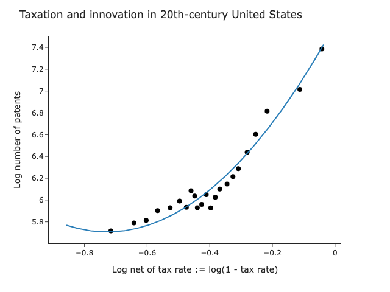

# Dataframe agnostic binscatter plots

**TL;DR:** Fast binscatter plots for all kinds of dataframes.

- Built on the `narwhals` dataframe abstraction, so pandas, Polars, DuckDB, Dask, and PySpark inputs all work out of the box.
- Uses `plotly` as graphics backend - because: (1) it's great (2) it uses `narwhals` as well, minimizing dependencies
- Lightweight - little dependencies
- Just works: by default picks the number of bins automatically via the DPI (Direct Plug-In) selector from Cattaneo et al. (2024) - no manual tuning

## What are binscatter plots?

Binscatter plots group the x-axis into bins and plot average outcomes for each bin, giving a cleaner view of the relationship between two variables—possibly controlling for confounders. They show an estimate of the conditional mean, rather than all the underlying data as in a classical scatter plot.

## Installation

```bash
pip install binscatter
```

---

## Example

This binscatter reproduces the taxation-and-innovation application in
[Cattaneo et al. (2024)](https://doi.org/10.1257/aer.20221576), using the public
[Akcigit et al. (2021) replication data](https://doi.org/10.7910/DVN/SR410I).



The original Gapminder example uses the default DPI (Direct Plug-In) selector:

```python
import plotly.express as px
from binscatter import binscatter

df = px.data.gapminder()
binscatter(df, "gdpPercap", "lifeExp")
```


See the [rendered demo notebook](https://github.com/matthiaskaeding/binscatter/blob/notebooks/demo.ipynb) for more examples. This package implements binscatter following [Cattaneo et al. (2024)](https://doi.org/10.1257/aer.20221576).

## Tests

- Check a representative sample while working: `make test-fast` (~18s)
- Run the whole suite without PySpark: `make test`
- Run the full backend matrix, including PySpark: `make test-spark`
